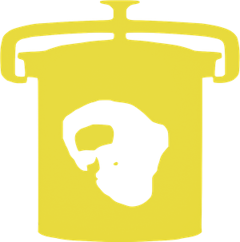

# Dead Writers

[Live Site](http://dead-writers.herokuapp.com).

This is a web app that generates new text from the works of deceased writers.
There are currently 7 authors on the site:

- The Brother's Grimm
- Edgar Allan Poe
- Oscar Wilde
- Virginia Woolf
- Lewis Carroll
- William Shakespeare
- HP Lovecraft

The new text is generated from an [API](https://re-tweet.herokuapp.com/api/v1/quote) that I built that serves up an n-th order Markov model. The API also lets users to tweet their favorite quotes to the 'dead-writers' Twitter account.

## Deployment

Click here for the [live site](http://dead-writers.herokuapp.com)

## Built With

- Javascript ES6
- Node.js/Express.js
- Redux
- Redux Saga

## Authors

- **Jamie McCrory**

## License

This project is licensed under the MIT License - see the [LICENSE.md](LICENSE.md) file for details

## Note

A Markov model is "a stochastic model used to model randomly changing systems" in this case the order of words an author uses.

-https://en.wikipedia.org/wiki/Markov_model

## Create React Saga

This repository is bootstrapped with [Create React Saga](https://github.com/sprakash57/create-react-saga).
